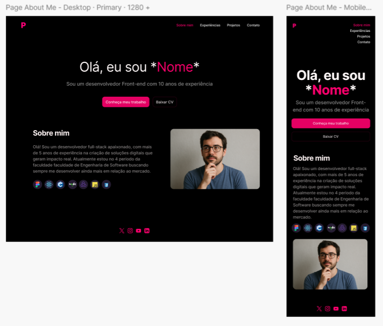
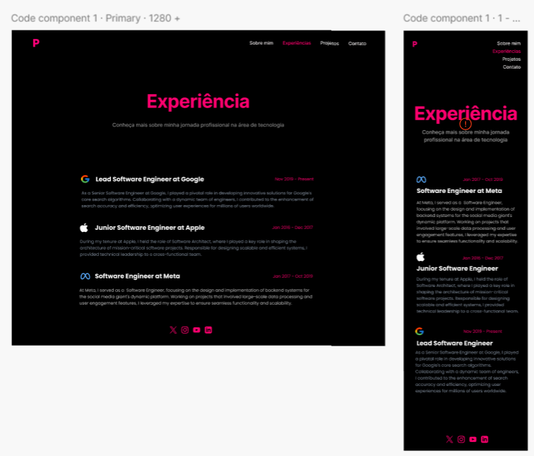
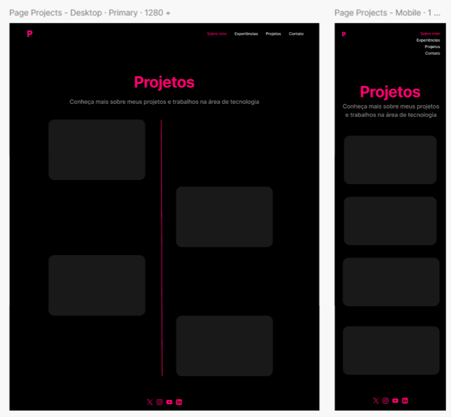
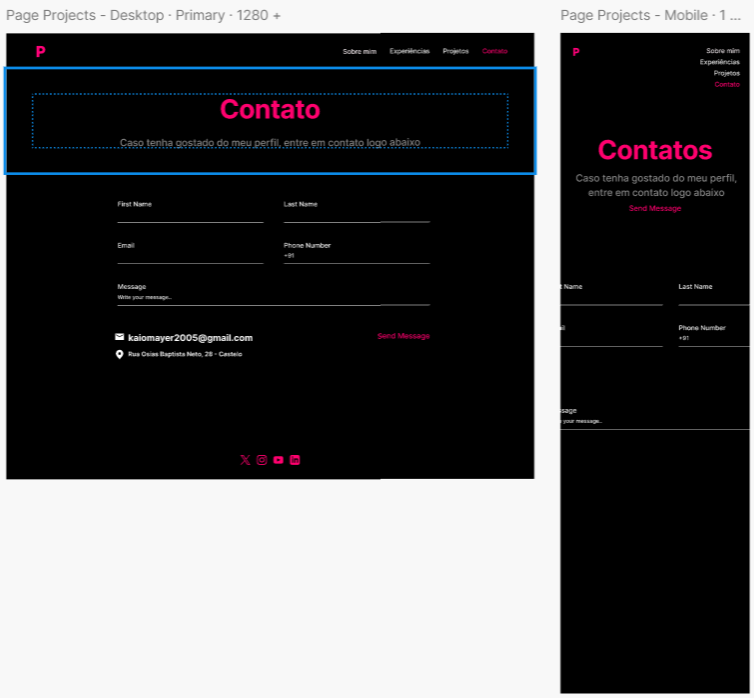

# Portfolio
## 📖 Descrição do Projeto
Este projeto consiste no desenvolvimento de um **website de portfólio profissional** com o objetivo de apresentar de forma moderna, responsiva e acessível a trajetória, habilidades, projetos e formas de contato. 

O site contará com:  

- **Sobre Mim** – Apresentação em português e inglês, destacando formação, área de atuação, interesses e objetivos profissionais.  
- **Projetos** – Linha do tempo de projetos, com nome, descrição, tecnologias utilizadas, link para o repositório e imagens/GIFs demonstrando o funcionamento.  
- **Experiências** – Registro de experiências profissionais, estágios, freelas e participações em eventos ou projetos.  
- **Contato** – Ícones clicáveis e formulário funcional para envio de mensagens por e-mail.  

Os responsáveis pelo desenvolvimento do projeto são:  
- **Arthur Henrique Teixeira e Silva Bacelete**
- [Portfolio](https://link-que-sera-aberto.com)
- **Gabriel Nogueira Vieira Resende**
- [Portfolio](https://portfolio-blond-kappa-81.vercel.app)
- **Kaio Souza Oliveira Mayer**
- [Portfolio](https://my-portfolio-dev-xi.vercel.app/about)
- **Mateus Rodrigues Costa**
- [Portfolio](https://portifolio-git-main-mateus-projects-b5111fc2.vercel.app)
## 🛠️ Tecnologias Utilizadas
- Java 21
- Spring Boot 3.5.4
- Angular
- Figma
- GitHub e Git
- Docker
## Como Rodar o projeto
  Você precisará ter um e-mail Google ativo e com a autenticação em duas etapas ativada.
  ```.env 
  EMAIL - seu email compelto 
  APP-PASSWARD - Sua cheve de app do google
```
## 🎨 Protótipos e Telas
  
  
  
  


